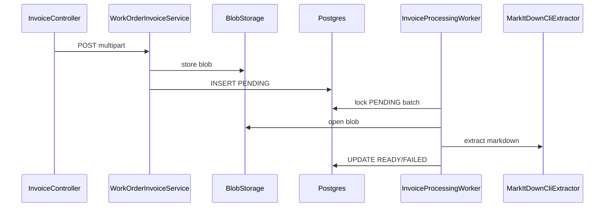

# Ghid backend — Work Order Invoices

Modulul Invoices oferă upload dedicat de facturi per work order, separat de tab-ul Files. Fișierele originale sunt stocate în blob storage opac; conținutul este extras asincron în **markdown** via **Microsoft MarkItDown** (v1), cu un pipeline pregătit pentru înlocuirea extractorului cu AI.

## Arhitectură



- **Nu** folosește `work_order_files` — facturile nu apar în Files.
- Chei blob: `{firmId}/{workOrderId}/invoices/{invoiceId}.ext`
- La ștergere work order / firmă: rândurile sunt șterse explicit; blob-urile sub prefixul work order-ului sunt curățate via `deleteByPrefix`.

## Schemă (V8)

Tabel `work_order_invoices`: metadata fișier + `processing_status` (`PENDING` | `READY` | `FAILED`), `markdown_text`, `processing_error`, `processed_at`.

Index parțial pe `processing_status = 'PENDING'` pentru worker.

## API

Base: `/firms/{firmId}/work-orders/{workOrderId}/invoices`

| Method | Path | Descriere |
|--------|------|-----------|
| GET | `/` | Listă paginată; fără `markdownText` |
| POST | `/` | Upload single |
| POST | `/batch` | Upload batch |
| GET | `/{invoiceId}` | Detaliu + markdown când READY |
| GET | `/{invoiceId}/content` | Download original |
| POST | `/{invoiceId}/retry` | FAILED → PENDING + reprocesare |
| DELETE | `/{invoiceId}` | Ștergere |

## Procesare MarkItDown

1. Upload validează MIME (implicit: `application/pdf`, `image/`).
2. Rând creat cu `PENDING`.
3. După commit: `processAsync` + worker `@Scheduled` ca safety net.
4. Worker folosește `FOR UPDATE SKIP LOCKED` pentru concurență.
5. Blob materializat în temp file → `markitdown <file>` → stdout = markdown.

### Cerință runtime

```bash
pip install 'markitdown[all]'
markitdown --help
```

Config (`application.yml`):

```yaml
app:
  invoices:
    markitdown-command: markitdown
    markitdown-timeout: 120s
    processing-poll-interval: 2s
    processing-batch-size: 5
    extractor: markitdown   # stub în teste
```

## Extensibilitate AI

Interfața `InvoiceMarkdownExtractor` permite o implementare viitoare `AiInvoiceMarkdownExtractor` selectată via `app.invoices.extractor=ai`, fără schimbări în controller sau `WorkOrderInvoiceService`.

## Erori

- **400** — MIME nepermis, retry pe non-FAILED
- **404** — invoice inexistent
- **413** — fișier/batch prea mare
- **429** — rate limit pe POST upload (același limiter ca files)
